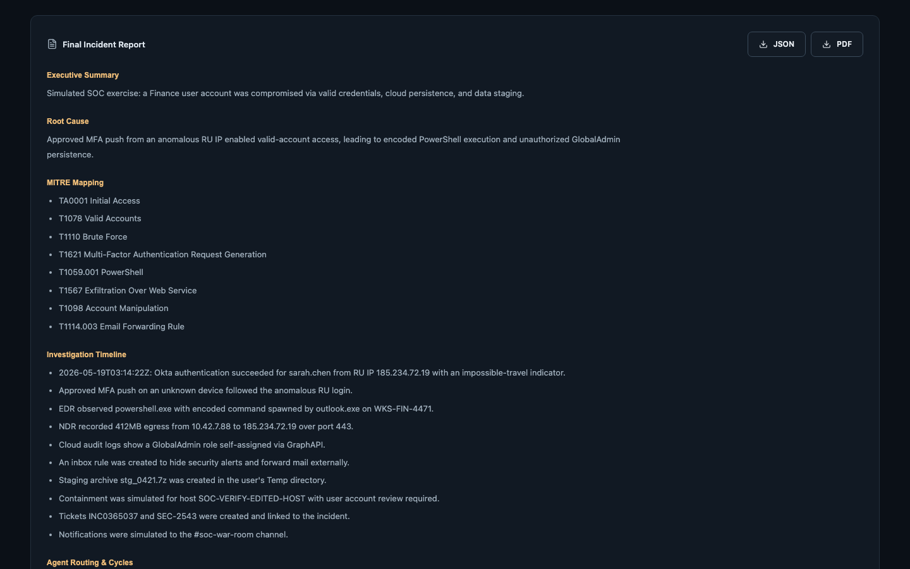
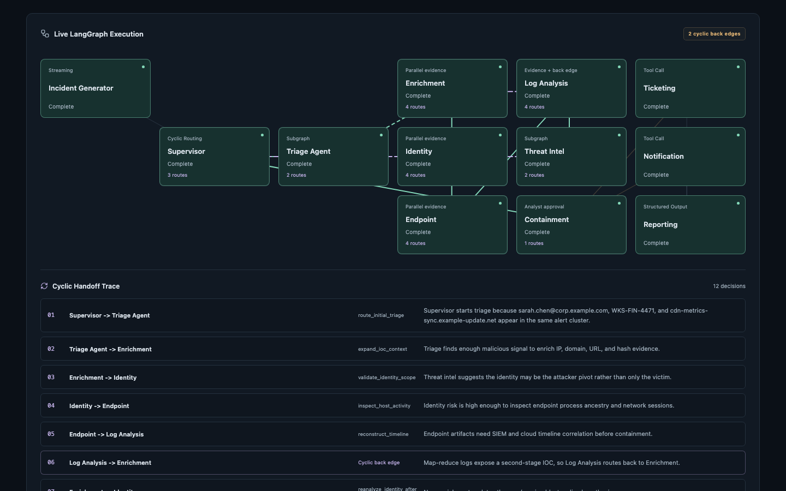
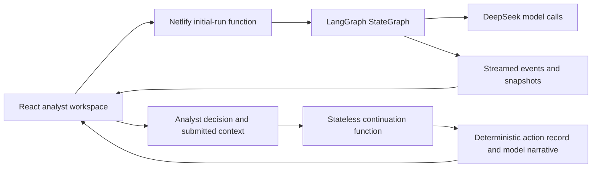

# Sentinel: SOC Investigation Workspace

**A transparent AI investigation workflow, from a security alert to an analyst decision and an evidence-backed report.** Built by [Shanto Mathew](https://github.com/shanto12) as a personal engineering project.

[Open live application](https://security-ops-playbook-analyzer.netlify.app) · [Explore the orchestration code](netlify/functions-src/agent-run.mts) · [Review the tests](tests)



## Review it in three minutes

1. Open the live application and choose **Generate Incident** or **Start first investigation**.
2. Follow the execution graph and inspect the ten synthetic evidence requests, handoffs and model audit details.
3. Approve, reject or edit the simulated containment request; inspect the final report and export JSON or print/save PDF.
4. Select a checkpoint to request an alternate branch analysis.

The hosted investigation makes real model requests. Security alerts, enterprise tool responses and containment actions are synthetic; no real security system is modified.

## Engineering worth inspecting

- **Cyclic orchestration:** the initial investigation executes a real LangGraph `StateGraph`, with observable node transitions and specialist handoffs.
- **Human decision authority:** edited targets, durations and approve/reject decisions determine the simulated execution record. The report cannot silently replace those facts with model prose.
- **Observable model calls:** provider/model identity, latency, token usage, request/response data and status appear in the investigation audit.
- **Explicit failure handling:** unavailable providers and failed report generation are surfaced instead of being shown as successful investigations.
- **Reviewable outputs:** graph, evidence, report, export and alternate analysis share one investigation context.



Both screenshots are actual September 2026 production captures using synthetic security evidence.

## Architecture and state



| Layer | Implementation |
|---|---|
| Interface | React, TypeScript and Vite |
| Initial orchestration | `@langchain/langgraph` with cyclic edges |
| Hosted backend | Netlify Functions; source in [functions-src](netlify/functions-src), shared [provider configuration](netlify/lib/provider.ts) |
| Model provider | DeepSeek Flash by default; optional configured Z.ai route |
| State | Browser-held investigation snapshots and submitted continuation context |
| Persistence | No shared database or durable LangGraph checkpointer |

Resume is a separate stateless function using submitted checkpoint context. Replay asks the model for alternate branch analysis. Neither is a persistent LangGraph checkpoint/Command replay service; reloading clears the active investigation. Specialist routing has a predefined cyclic plan unless the model supplies a routing plan.

## Run locally

Use a current Node.js LTS release and npm.

```sh
git clone https://github.com/shanto12/security-ops-playbook-analyzer.git
cd security-ops-playbook-analyzer
npm ci
npm run dev
```

The Vite command serves the interface. For the complete local workflow, configure server-side variables from [.env.example](.env.example), build the function bundles, and use Netlify Dev:

```sh
npm run build
npx netlify-cli dev
```

Set `AI_PROVIDER=deepseek` and a valid `DEEPSEEK_API_KEY` in the local server environment or Netlify environment settings. Credentials must never use a `VITE_` prefix. The browser does not receive provider keys. Model execution uses the configured provider account.

## Verify the code

```sh
npm run verify
npm audit --omit=dev
```

`verify` runs lint, unit tests and the production build. [Provider tests](tests/provider.test.ts), [report-authority tests](tests/report-authority.test.ts) and [audit-evidence tests](tests/llm-api-log-evidence.test.ts) cover consequential failure and consistency paths. The [production verification script](scripts/verify-refresh.mjs) keeps paid generation behind an explicit `--live` flag; its default mode does not run paid model workflows. Earlier May 2026 files in `docs/` are historical evidence, not current release proof.

## Scope

This is a public portfolio lab with no login or durable access-controlled case storage. SIEM, EDR, identity, ticketing, firewall and notification interfaces are simulated. No live containment, ticket creation or external notification occurs. The existing instance-local run limiter is best effort, not a global spending cap. `/api/health` verifies model-catalog reachability, not generation quota or completion of an investigation.
